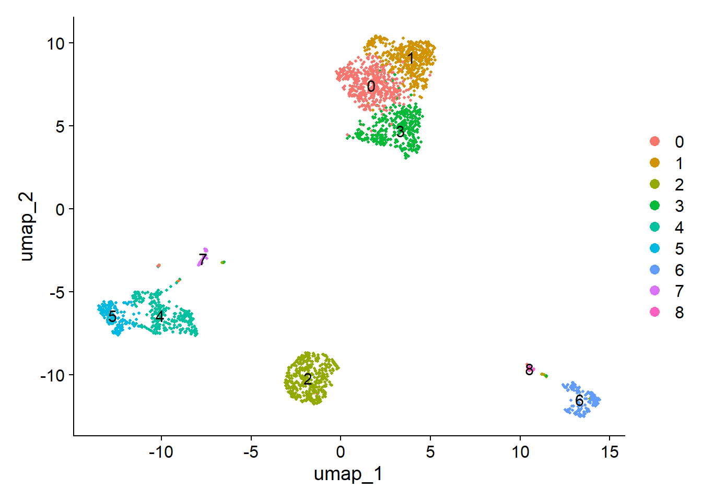

# Analysis of an unknown single-cell dataset

Analysis of an unknown single-cell dataset for [Single Cell and Spatial Omics](https://unitn.coursecatalogue.cineca.it/insegnamenti/2023/95642/2016/9999/10616?annoOrdinamento=2016) class of the QCB master

## Analysis Workflow

### 1. Quality Control and Filtering
- **QC Metrics**: Evaluate number of genes detected per cell, total counts per cell, and percentage of reads mapping to mitochondrial genes or spike-in RNAs (ERCCs).
- **Filtering**: Remove cells with low counts, low gene detection, or high mitochondrial content (or high ERCC counts).

### 2. Normalization and Scaling
- **Normalization**: Apply `LogNormalize` to scale data, ensuring each cell has the same total expression.
- **Variable Feature Identification**: Use `FindVariableFeatures` to identify highly variable genes.
- **Scaling**: Standardize data to zero mean and unit variance using `ScaleData`.

### 3. Dimensionality Reduction
- **PCA**: Perform Principal Component Analysis to reduce data dimensionality.
- **UMAP/t-SNE**: Further reduce dimensions for visualization using UMAP or t-SNE.

  

### 4. Clustering
- **Clustering**: Group cells into clusters using the Louvain or Leiden algorithm based on gene expression patterns.

### 5. Identification of Marker Genes
- **Marker Genes**: Conduct differential expression analysis (`FindMarkers`) to identify cluster-specific marker genes.

### 6. Cell Cycle Analysis
- **Cell Cycle Scoring**: Assign cell cycle phases (G1, S, G2/M) to each cell using known cell cycle markers.

### 7. Annotation
- **Cluster Annotation**: Annotate clusters based on known marker genes or databases (e.g., CellMarker, PanglaoDB).
- **Hypothesis Formation**: Formulate a hypothesis about the tissue origin and cell types based on clusters and marker genes.

## Credits

This analysis was conducted using the following R packages:
- [Seurat](https://satijalab.org/seurat/): An R package designed for QC, analysis, and exploration of single-cell RNA-seq data.
- [ggplot2](https://ggplot2.tidyverse.org/): An R package for data visualization based on the grammar of graphics.
- [tidyverse](https://www.tidyverse.org/): A collection of R packages for data manipulation and visualization, including ggplot2.

  

